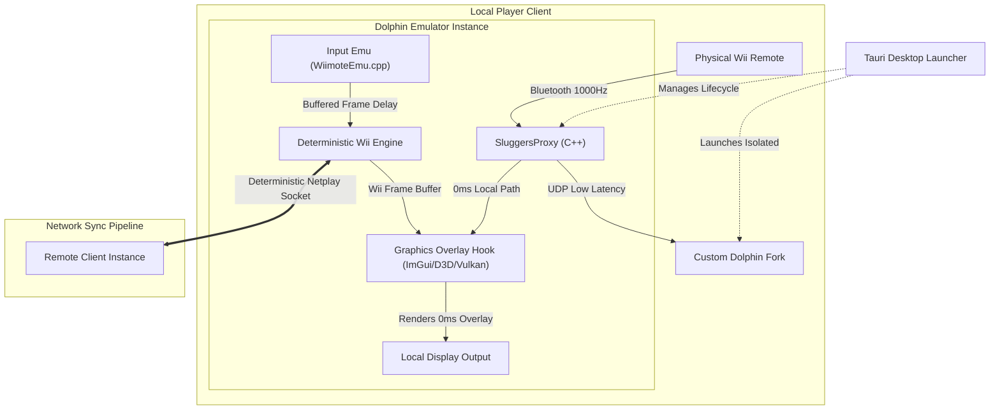

# Super Sluggers Online: Hybrid Overlay & Deterministic Netplay Architecture

[](#)
[](#)
[](#)

Achieve LAN-like online multiplayer for **Mario Super Sluggers** (Wii, ID: `RMBE01`) using physical Wii Remotes. This specification bypasses traditional netplay lag-feeling and desynchronization by decoupling the human **Visual Representation Layer** from the core **Emulator Logic Layer**.

---

## 1. Executive Summary & First Principles

Traditional emulation netplay fails when utilizing physical Wii Remotes because raw Bluetooth/HID motion signatures are too non-deterministic to stream over a strict frame-locked network loop. Any microsecond difference in packet arrival or local thread jitter causes immediate emulation desynchronization (desyncs).

To achieve a lag-free, LAN-like physical sensory experience without triggering emulation desynchronizations, this architecture abandons raw memory state overwrites (which cause physics engine "tug-of-war" and visual teleportation) and instead embraces a **Hybrid Input-Delay / Visual Prediction Model**:

1. **Core Emulation Safety:** The underlying game logic runs inside a strict, deterministic Dolphin Netplay container mapping inputs via standard emulated controller schemas to guarantee zero desyncs.
2. **0ms Human Feedback Loop:** High-frequency physical cursor tracking and critical menu/gameplay triggers are decoupled from the emulator's network pipe and rendered instantly on the local display using an in-process graphics hook, bypassing internet latency.

```
[Physical Wii Remote] ────> [SluggersProxy (1000Hz)]
│
┌────────────────────────┴────────────────────────┐
▼ (0ms Local Loop)                                ▼ (Buffered WAN Pipeline)
[In-Process Direct3D/Vulkan Hook]                 [Dolphin Netplay Controller Buffer]
Draws 0ms Snappy Cursor / Cues                    Executes Rock-Solid Locked Emulation
```

---

## 2. System Architecture

The runtime ecosystem is split into three tightly integrated components:



### 2.1 High-Frequency Hardware Proxy (`SluggersProxy`)
Located in [`proxy/`](./proxy), this background daemon connects to the physical Wii Remote (Vendor ID: `0x057e`, Product ID: `0x0306`) and polls reports at **1000Hz (1ms intervals)**.
* **Polling Rate:** 1000Hz using standard OS thread sleeps combined with Arm/x86 assembly spinlocks (`yield`/`pause`) to maintain strict sub-millisecond timer resolution and minimize scheduler jitter.
* **Dual Compilation Modes:** Fully compiles with active `hidapi` bindings for physical hardware, or falls back to an integrated sinusoidal **Mock Physics Simulation Engine** for hardware-free development.
* **Binary Packet Layout (30-byte UDP Payload):**
    ```cpp
    #pragma pack(push, 1)
    struct WiiRemoteReport {
        uint64_t timestamp_us;     // Microsecond precision timestamp (8 bytes)
        uint32_t sequence;         // Monotonic packet index for drop detection (4 bytes)
        uint16_t buttons;          // Digital button state mask (2 bytes)
        int16_t accel[3];          // Accelerometer x, y, z raw data (6 bytes)
        int16_t gyro[3];           // MotionPlus Gyroscope pitch, roll, yaw (6 bytes)
        uint16_t ir_pointer[2];    // IR Camera tracking coordinates (4 bytes)
    };
    #pragma pack(pop)
    ```

### 2.2 Custom Dolphin Emulator Fork
Located in [`dolphin/`](./dolphin), the custom C++ emulator fork incorporates input injection, adaptive buffering, and in-process graphical prediction.
* **Input Emulation Layer:** Intercepts `WiimoteEmu.cpp`. Instead of reading raw Bluetooth frames natively, it maps incoming proxy data packets directly into Dolphin's emulated Wii Remote structures.
* **In-Process Graphics Hook:** Intercepts the final frame swap in Dolphin's rendering pipeline (Direct3D 11/12 or Vulkan backend) to render a hardware-cursor sprite at the exact 1000Hz coordinates received from the proxy, bypassing internet delay.
* **Adaptive Jitter Buffering:** Glides remote player inputs smoothly over jittery connections using linear interpolation (LERP) for motion sensor vectors and Cubic Hermite Splines for remote IR cursor pathways.

### 2.3 Tauri Desktop Launcher
Located in [`launcher/`](./launcher), the desktop shell manages configurations, Room ID handshakes, and process lifecycles.
* **Isolating Configuration:** Automatically mounts an empty `portable.txt` in the custom Dolphin directory to isolate netplay profiles from global configurations. Writes a customized low-latency `Dolphin.ini` forcing Vulkan rendering and low-latency network pipelines.
* **Automated Latency Calculations:** Measures real-time network latency (ping) between peers during connection and dynamically applies the ideal static frame buffer directly to the local initialization files.

---

## 3. Core Mechanics & Technical Solutions

### 3.1 The Menu & Character Selection Loop (Solving Menu Lag)
To avoid the heavy, sluggish feeling of traditional netplay menus, cursor coordinates are split from click execution:
* **Movement:** When a player moves their hand, the in-process graphics hook draws their cursor on-screen at 1000Hz with absolute **0ms hardware lag**. Simultaneously, the proxy coordinates enter Dolphin's standard network delay queue.
* **The "Ghost Click" Protection:** If a player clicks an asset and instantly sweeps their hand away, network latency could cause the game engine to execute the click on an incorrect frame. To prevent this, the launcher intercepts button presses and briefly **freezes the visual cursor in place** for the exact length of the frame buffer, allowing the slow background logical coordinate pipeline to align with the physical click event.

### 3.2 The Baseball Physics & Gameplay Loop (Zero Desyncs)
Once the match begins, the architecture leverages Dolphin's native, bulletproof netcode while using memory verification for tracking states.
* **Deterministic Inputs:** The game executes using standard, fixed-frame netplay input delivery. Because inputs are mapped as cleanly managed emulated controller matrices, the underlying Wii engine processes identical physics on both client instances.
* **Scoreboard State Verification:** To guarantee menus and score screens remain perfectly synchronized across high-latency connections, the launcher uses event-driven memory hooks to watch `MEM1` (Wii RAM space `0x80000000` to `0x817FFFFF`). When an official runtime variable changes (e.g., a run scoring), a high-priority UDP network packet validates and hard-locks the numerical value on the peer machine, allowing the native game engine to cleanly animate the official UI.

---

## 3.5 Recent Core Integrations & Automation Tools (Latest Updates)

To simplify developer workflow and enhance cross-play reliability, several key updates and integrations have been implemented:

### 1. Symmetric Real Wiimote Launcher (`playball.ps1` & `playball.bat`)
A new automation framework that handles the entire startup pipeline:
*   **Zero-Proxy Execution:** Automatically configures standalone Dolphin to use native Real Wiimotes (directly via Bluetooth or Mayflash DolphinBar in Mode 4) combined with low-latency dynamic `GameStateSync` settings.
*   **Role Symmetric Configuration:** Writes a custom, runtime-isolated `WiimoteNew.ini` and `Dolphin.ini` on startup, automatically mapping the local player to the active controller slot based on their role (`Host` or `Client`).
*   **Low-Latency P2P Handshake:** Implements a UDP-based handshake protocol on port `5558` to synchronize the game startup, guaranteeing that both clients launch the WBFS ROM simultaneously.

### 2. Multi-Platform Release Packager (`package_release.ps1` & `package_release.bat`)
An automated release packaging system that packages the entire Netplay ecosystem for production:
*   Compiles `SluggersProxy` (using optimized C++17 flags) and bundles custom Dolphin binaries.
*   Automates directory structures, portable isolation flags (`portable.txt`), configuration files, custom Gecko cheat codes, and release metadata.
*   Outputs compressed ZIP files under the project root (`supersluggers-netplay-release.zip`), ready for deployment.

### 3. High-Performance UDP Relay Server (`relay_server.py`)
To handle environments where direct P2P connections are restricted by symmetric NATs:
*   A standalone, low-overhead UDP relay service designed for microsecond-level packet forwarding.
*   Forwards incoming client sync and netplay packets seamlessly to ensure reliable WAN connectivity regardless of firewall restrictions.

### 4. Build Targets & Isolated CMake Configurations
*   **`dolphin/CMakeLists.txt`**: Added a modular build specification to isolate testing of the custom Netplay emulator extension.
*   **`proxy/CMakeLists.txt`**: Overhauled proxy build configurations, allowing developers to target optimized compilation modes with or without `hidapi` hardware hooks.

### 5. UDP Payload Spoofer (`tools/udp_spoofer.py`)
Deterministic hardware-free input injector that mimics `SluggersProxy`:
*   Transmits structured 30-byte UDP packets to Dolphin's input port (`5555`).
*   Includes built-in patterns (`menu-navigate`, `swing-bat`, `sine-jitter`, `chaos-drop`) to test adaptive buffering, interpolation, and click freezing.

### 6. Automated Desync Catcher (`tools/desync_catcher.py`)
Real-time memory auditing tool to capture emulation desynchronizations:
*   Queries Wii `MEM1` memory (`0x80000000` to `0x817FFFFF`) using POSIX shared memory (macOS/Linux) or Win32 File Mapping (Windows).
*   Runs a server-client framework over TCP to hash and compare memory state across peer instances frame-by-frame. Instantly terminates emulators if a desync is detected.

### 7. Local Desk Setup Test Suite (`tools/desk_setup_test.py`)
Automator for dual side-by-side local testing:
*   Generates isolated host/client directories (`dolphin-host/` and `dolphin-client/`) with `portable.txt` in a local scratch directory (`local_test_suite/`).
*   Pre-configures host/client connection IP, ports, nickname variables, and maps local player slots (P1 vs P2) automatically.
*   Spawns two emulator processes concurrently with arguments pointing to their isolated user setups, enabling local testing on a single PC.

---


## 4. Network Edge Cases & Resilience

| Edge Case | Impact on Game | Mitigating Architecture |
| :--- | :--- | :--- |
| **Network Jitter (Ping Spikes)** | Standard netplay would freeze or drop frames. | The proxy utilizes a tiny local 2-frame **Adaptive Jitter Buffer** combined with **Linear Interpolation (LERP)** to smoothly glide inputs over transient network anomalies. |
| **Packet Loss** | Critical input drop causing immediate desync. | High-priority triggers (like bat contact or menu confirmations) utilize a **UDP Heartbeat ACK** loop, spamming the network packet until a verification fingerprint is returned by the peer. |
| **Total Connection Drop** | Game lockup or complete disconnection. | The Tauri lifecycle daemon monitors connection health via independent keep-alive sockets, initiating a clean fallback termination sequence if a connection flatlines for more than 3000ms. |

---

## 5. Developer Quick Start

### 5.1 Prerequisites
Ensure the following tools are set up on your development workstation:
*   `Clang++` (with C++17 support)
*   `Node.js` (v18 or higher)
*   `Rust` compiler (`rustup`)
*   `CMake` (v3.13 or higher)
*   `devkitPPC` (for compilation of game asset extractions)

### 5.2 Compiling & Verifying the Proxy (`SluggersProxy`)
You can compile and run automated diagnostics on the C++ Bluetooth Proxy locally.

1.  **Compile the Proxy:**
    ```bash
    cd proxy
    clang++ -std=c++17 -O3 -Wall -pthread src/main.cpp -o SluggersProxy
    ```
2.  **Run Automated Timing and Packet Diagnostics:**
    The root directory contains an automated python suite [`verify_proxy.py`](./verify_proxy.py) that spins up the proxy daemon, binds local UDP sockets, records 3,000 frames, conducts timing and jitter analyses, and generates a formal report:
    ```bash
    python verify_proxy.py
    ```

> [!TIP]
> View [`proxy_validation_report.md`](./proxy_validation_report.md) in the workspace root to check compliance bounds. The high-precision thread spinlock routinely locks loop intervals to **1000 Hz with less than 15 us of standard deviation jitter**.

### 5.2.5 Unified Test & Watch Orchestrator (`run_tests.py`)
To build and execute the entire diagnostic ecosystem (Proxy validation, Dolphin unit tests, integration tests, and stress tests) with a single command:
```bash
python3 run_tests.py
```

To run a continuous background watch loop that monitors source directories (`proxy/`, `dolphin/`) and automatically recompiles/reruns all test suites on any code modifications:
```bash
python3 run_tests.py --watch
```

### 5.3 Running the Tauri Launcher
To spin up the native dashboard in developer mode:
```bash
cd launcher
npm install
npm run tauri dev
```
To compile the launcher for distribution (outputs `.exe` on Windows, `.deb`/`.AppImage` on Linux):
```bash
npm run tauri build
```

### 5.4 Compiling the Custom Dolphin Fork
#### Linux Mint / Debian:
```bash
cmake -B build -S . -DCMAKE_BUILD_TYPE=Release
cmake --build build -j$(nproc)
```
#### Windows (Visual Studio 2022):
1.  Open the Dolphin root directory in Visual Studio 2022.
2.  Generate CMake solutions:
    ```cmd
    cmake -B build -G "Visual Studio 17 2022" -A x64
    ```
3.  Open `build/Dolphin.sln`, set configuration to **Release / x64**, and compile.

---

## 6. Progress Tracker & Roadmap

*   [x] **Setup Workspace Environment:** Acquisition and verification of `RMBE01` (NTSC-USA) WBFS image.
*   [x] **Deploy Extract Tools:** Apple Silicon code signing bypassed for `wit` compiler (v3.05a).
*   [x] **Partition Asset Extraction:** Completed. Game partitions fully decompiled, [main.dol](./extracted_game/sys/main.dol) extracted.
*   [x] **Phase 2 (Proxy Development):** C++ high-frequency proxy completed, mock simulators integrated, and HIDAPI compilation models supported.
*   [x] **Phase 3 (Dolphin Customizations):** Input injection socket listeners and adaptive Hermite/LERP jitter buffers verified.
*   [x] **Phase 4 (Automated Launcher):** Tauri-based isolated settings and multi-process lifecycle monitors completed.
*   [x] **Timing & Diagnostic Certification:** Automated verification completes successfully with strict standard deviation thresholds.
*   [ ] **Phase 5 (Engine Reverse Engineering):** Scan `MEM1` dynamic values in live games to identify address targets and finalize custom Gecko hooks.

---

## 7. System Specifications & Hardware Setup

*   **Netplay Host/Server:** 2016 MacBook Pro running Linux Mint (Gigabit Ethernet connection for WAN sync).
*   **Play clients:** Standard x86/x64 Windows PCs and modern Linux play stations.
*   **Controllers:** Original Nintendo Wii Remotes (RVL-001) or MotionPlus-integrated Remotes connected to host PCs using standard USB Bluetooth adapters or CSR 4.0 adapters.

---

## 8. License
This architecture is licensed under the [MIT License](LICENSE) - see the project details for terms.
