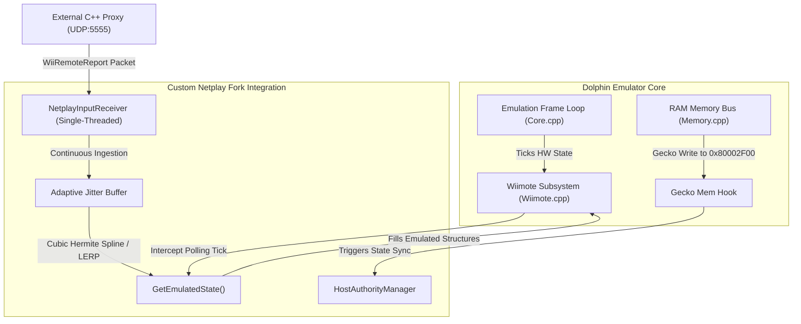

# Architectural Specification: Custom Dolphin Netplay Fork

This document details the software integration hooks, memory interception architecture, and mathematics required to merge our Custom Input Injection and Adaptive Jitter Buffer subsystems into the native Dolphin Emulator C++ source code.

---

## 1. Dolphin Emulator Integration Hooks

To inject the Bluetooth proxy's inputs and enforce dynamic host authority, we hook two core subsystems inside the Dolphin source tree: the **Input Polling Routine** and the **Memory Write Bus**.



### 1.1 Hook 1: Input Interception
*   **Target File:** `Source/Core/Core/HW/WiimoteEmu/WiimoteEmu.cpp` (or `Source/Core/Core/HW/Wiimote.cpp` depending on clean release revision).
*   **Action:** Intercept the function responsible for copying physical controller axes/buttons into the emulated Wii Remote's input buffers (typically `UpdateInput()` or `Poll()`).
*   **Integration Code:**
    ```cpp
    #include "../../../dolphin/input_injection.h"

    void Wiimote::UpdateInput() {
        if (NetplayInputReceiver::GetInstance().IsActive()) {
            // Retrieve high-fidelity interpolated reports from our adaptive buffer
            EmulatedWiimoteState state = NetplayInputReceiver::GetInstance().GetEmulatedState();
            
            // Map directly into Dolphin's raw button/sensor registers
            m_buttons = state.buttons;
            m_accel_x = state.accel[0];
            m_accel_y = state.accel[1];
            m_accel_z = state.accel[2];
            m_gyro_pitch = state.gyro[0];
            m_gyro_roll = state.gyro[1];
            m_gyro_yaw = state.gyro[2];
            m_ir_x = state.ir_pointer[0];
            m_ir_y = state.ir_pointer[1];
            return; // Bypass standard keyboard/device mapping
        }
        
        // ... Original Dolphin mapping logic fallback ...
    }
    ```

### 1.2 Hook 2: Gecko Memory Sync Hook
*   **Target File:** `Source/Core/Core/Memory.cpp` (specifically inside the 8-bit RAM write handler `Write_U8()`).
*   **Action:** Monitor writes targeting our safe netplay state register address: `0x80002F00`.
*   **Integration Code:**
    ```cpp
    #include "../../../dolphin/input_injection.h"

    void Memory::Write_U8(const u8 val, const u32 address) {
        // Intercept writes targeting our custom Gecko Netplay register
        if (address == 0x80002F00) {
            NetplayInputReceiver::GetInstance().SyncGeckoState(val);
        }
        
        // ... Original Dolphin RAM memory write routine ...
    }
    ```

---

## 2. Jitter Buffer Interpolation Mathematics

Network packets experience variable delay (jitter) over WAN connections. If the emulator plays back inputs frame-by-frame, delayed packets force the rendering loop to pause, causing gameplay micro-stuttering. 

To solve this, our **Adaptive Jitter Buffer** plays back inputs from a time-warped queue, dynamically interpolating state data for missing frames.

```
Incoming packets:   [P0] ─── (jitter) ───> [P1] ───────> [P2] ─── (drop) ───> [P3]
                                              ▲             ▲
Buffer Playback:                              └─── [LERP] ──┘ (Smooth glide)
```

### 2.1 Accelerometer & Gyroscope LERP
Accelerometer and gyroscope vectors are smoothed using standard **Linear Interpolation (LERP)** over the fractional playback offset $t$ between the framing packets $P_1$ and $P_2$:

$$\vec{A}_{\text{interpolated}} = \vec{A}_1 + t \cdot (\vec{A}_2 - \vec{A}_1)$$

$$\text{where } t = \frac{T_{\text{target}} - T_1}{T_2 - T_1}$$

### 2.2 IR Pointer Cubic Hermite Spline
Because the batting/pitching cursor coordinates are highly sensitive to sudden spatial jumps, simple linear interpolation causes rigid visual corners. We apply a **Cubic Hermite Spline** using four surrounding packets ($P_0$, $P_1$, $P_2$, $P_3$) to compute a curved, fluid path for the IR coordinates $(X, Y)$:

$$P(t) = h_{00}(t) \cdot P_1 + h_{10}(t) \cdot \vec{m}_1 + h_{01}(t) \cdot P_2 + h_{11}(t) \cdot \vec{m}_2$$

#### Hermite Basis Functions:
$$h_{00}(t) = 2t^3 - 3t^2 + 1$$
$$h_{10}(t) = t^3 - 2t^2 + t$$
$$h_{01}(t) = -2t^3 + 3t^2$$
$$h_{11}(t) = t^3 - t^2$$

#### Finite Difference Tangents:
$$\vec{m}_1 = \frac{P_2 - P_0}{2}$$
$$\vec{m}_2 = \frac{P_3 - P_1}{2}$$

---

## 3. Dynamic Host Authority Protocol Flow

*Mario Super Sluggers* requires instant reflexes. Setting a fixed input delay of 50ms to maintain synchronization makes batting and pitching timing almost impossible. 

Our custom netcode resolves this by shifting input authority in real-time depending on which game state is active, maintaining **0ms local input latency** for the active player:

```
Pitching Phase:
  Pitcher Client ───> Instant Local Input (0ms) ───> Sends Inputs ───> Batter Client (renders pitch)

Hit Detected (Gecko hook writes 0x02 to 0x80002F00):
  Batter Client <─── Instant Local Input (0ms) <─── Holds Authority <─── Pitcher Client (renders fielding)
```

1.  **Pitching Phase (0x01):** The Pitching Client executes movements immediately (0ms delay) and sends inputs to the Batter. The Batter Client renders the incoming pitch with buffer delay, predicting trajectory.
2.  **Contact/Fielding Phase (0x02):** The millisecond the bat makes contact with the ball, our **Gecko Hook** writes `0x02` to `0x80002F00`. The memory write instantly triggers on both clients, shifting authority to the Batting/Fielding Client. 
3.  **Result:** The Batter/Fielder now holds local 0ms input authority, enabling smooth swings, running, and fielding reactions while the pitcher observes.

---

## 4. Platform Compiling Instructions

When compiling the custom Dolphin fork inside the repository, follow these setup guidelines on your target environments.

### 4.1 Linux Mint (Server)
Compile using `CMake` and `gcc-11` or higher:
```bash
# Install dependencies
sudo apt-get install git cmake g++ libgl1-mesa-dev libxrandr-dev libxi-dev \
                     libxinerama-dev libxcursor-dev libxkbcommon-dev \
                     libevdev-dev libudev-dev libsystemd-dev libavcodec-dev \
                     libavformat-dev libswscale-dev libasound2-dev libpulse-dev

# Generate Makefile
cmake -B build -S . -DCMAKE_BUILD_TYPE=Release

# Compile
cmake --build build -j$(nproc)
```

### 4.2 Windows PC (Home Playback Client)
Compile using **Microsoft Visual Studio 2022**:
1. Install VS 2022 Community with the **Desktop Development with C++** workload enabled.
2. Open the Dolphin root directory in Visual Studio (using folder view, which parses CMake natively) or generate a `.sln` file via command line:
   ```cmd
   cmake -B build -G "Visual Studio 17 2022" -A x64
   ```
3. Open `build/Dolphin.sln` inside Visual Studio.
4. Set solution configuration to **Release** and architecture to **x64**.
5. Build Solution.
