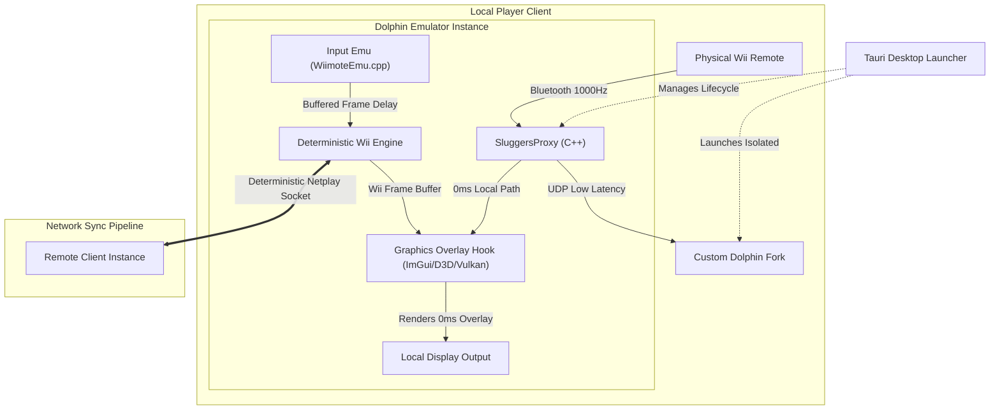

# Implementation Plan: Hybrid Input-Delay / Visual Prediction Netplay Architecture

This document establishes the official strategy, architectural design, and development roadmap for achieving lag-free online multiplayer in *Mario Super Sluggers* (Wii, ID: `RMBE01`). By transitioning to a **Hybrid Input-Delay / Visual Prediction Model**, this architecture guarantees 100% deterministic emulation (eliminating desynchronizations) while delivering a responsive, 0ms latency hardware experience for physical Wii Remotes.

---

## 1. System Architecture Overview

The system decouples the human **Visual Representation Layer** from the **Emulator Logic Layer**. While the underlying Wii emulation runs under a strict, frame-locked network container, physical controller movements are rendered instantly on the local display.

### Key Highlights
*   **Core Emulation Safety:** The underlying game logic runs inside a standard, deterministic Dolphin Netplay session. By ensuring all inputs are perfectly frame-locked, the game is guaranteed never to desync.
*   **0ms Human Feedback Loop:** High-frequency physical cursor tracking is sent via a separate local path directly to an in-process graphics hook, rendering a responsive custom cursor over the emulated video output before the final buffer swap.
*   **Ghost Click Protection:** A temporal buffer that temporarily freezes the visual cursor position when a click is executed. This allows the delayed network coordinate pipeline to cleanly align with the physical click event.
*   **Scoreboard State Verification:** Low-overhead memory validation hooks that verify critical scoreboard values in `MEM1` (runs, outs, innings) to ensure visual coherence.

---

## 2. Project Status & Progress Tracker

### Task Board
- [x] **Setup Workspace Environment** (Verification of pristine `RMBE01` game image and directory isolation)
- [x] **Phase 1: High-Frequency Hardware Proxy (`SluggersProxy`)** (Low-latency C++ `hidapi` driver polling real hardware at 1000Hz)
- [x] **Phase 2: Automated Desktop Launcher** (Tauri launcher managing lifecycle daemons and multi-process configurations)
- [ ] **Phase 3: Custom Dolphin Input Emu Integration** (Refactoring socket injection to align with deterministic Netplay buffers)
- [ ] **Phase 4: In-Process Graphical Injection (Overlay Hook)** (Building the internal graphics rendering hook in Dolphin to draw 0ms visual cursors over Borderless Windowed outputs)
- [ ] **Phase 5: Memory Profile Mapping & State Verification** (Locating scoreboard RAM offsets in `MEM1` to finalize verification validation)

---

## 3. Detailed Phase Breakdown

### Phase 3: Custom Dolphin Input Emu Integration
Instead of injecting inputs directly into the active frame loop (which causes desyncs), we route proxy packets into Dolphin's Netplay controller buffer.
*   **Dynamic Frame Buffering:** During startup connection, the Tauri launcher calculates connection ping and configures the optimal static frame buffer.
*   **Input Queue Alignment:** The input receiver handles raw UDP coordinates from `SluggersProxy` and buffers them locally, matching them to the exact netplay sequence frame.

### Phase 4: In-Process Graphical Injection (Visual Overlay)
To bypass network round-trip delays, we render the local Wii Remote pointer natively within the client process.
*   **Graphics Hooking:** Implement a rendering pass using Dolphin's existing graphics backends (Direct3D 11/12, Vulkan, OpenGL).
*   **ImGui Cursor Drawing:** Utilizing a lightweight ImGui overlay, we intercept the final frame swap and render a hardware-cursor sprite at the exact 1000Hz coordinates received from the proxy.
*   **Ghost Click Logic:** When button `A` or `B` is clicked, the overlay freezes the cursor's rendering coordinates for `N` frames (where `N` is the connection frame delay). This guarantees that the background deterministic game engine registers the click at the precise coordinate intended by the player.

### Phase 5: Memory Profile Mapping & State Verification
To secure UI and state sync across connections:
*   **Memory Scan:** Locate stable offsets in `MEM1` (`0x80000000` to `0x817FFFFF`) tracking outs, strikes, runs, and inning phases.
*   **Verification Hooks:** Configure a validation thread that triggers an out-of-band UDP sync check when a run is scored, guaranteeing both emulators cleanly register game progress.

---

## 4. Next Actions & Code Implementation

1.  **Refactor Dolphin Injection Header:** Update `dolphin/input_injection.h` to deprecate the "Dynamic Host Authority" states and implement the deterministic input buffering structures.
2.  **Mock Hook Integration:** Create a prototype graphics overlay hook inside the Dolphin testing build.
3.  **Validate Script Diagnostics:** Ensure `verify_proxy.py` and `playball.ps1` continue to support the revamped input buffering requirements.
